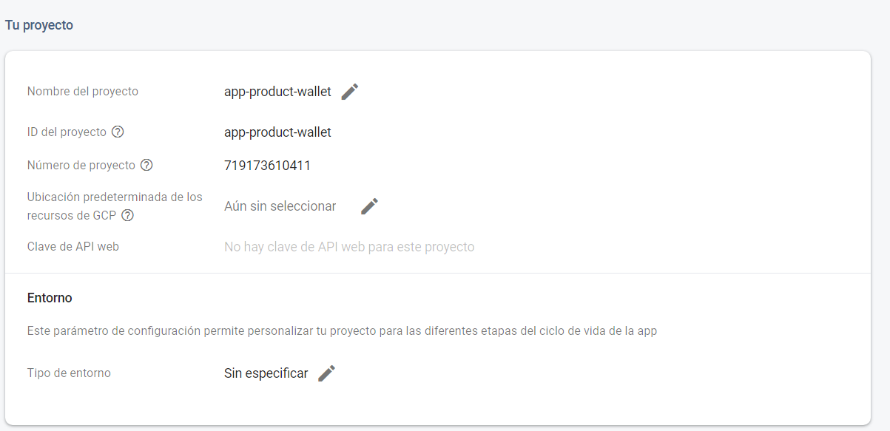

# Reto: Construir una billetera digital utilizando Ionic/Angular y Firebase

## Requisitos funcionales: 
La aplicación tendrá 3 Tabs:
1. Listado de cuentas: Listar las cuentas que tiene el cliente en Firebase.
Nota: Usted debe crear la data manualmente en Firebase Real Time Database para empezar.
2. Transferencias: El cliente podrá escoger dos cuentas, y transferir dinero de una cuenta a 
otra.
3. El ultimo Tab lo puede escoger usted.

Requisitos no funcionales:
Compatibilidad:
- Utilizar la versión 12 de Angular Core 
- Utilizar la versión de Ionic Framework Angular 5
- Utilizar la versión de Ionic Cli 6

Dado mi nivel de experiencia limitado con Angular, me encontré con desafíos al tratar de hacer que las versiones requeridas fueran compatibles. Debido a la mencionado anteriormente termine utilizando:

- Angular Core 16
- Ionic Framework Angular 7
- Ionic Cli 7
- Angular/Fire 12


## Firebase (Realtime Database)
```cmd
   npm install  @angular/fire
```

Se realiza la creacion del proyecto en firebase: 


De este obtenemos las credenciales necesarias que se agregaron al archivo enviroments.ts

Luego de esto se realizo las importaciones pertinentes para realizar la conexion:

``` typescript
import { AngularFireModule } from '@angular/fire/compat';
import { AngularFireAuthModule } from '@angular/fire/compat/auth';
import { AngularFireStorageModule } from '@angular/fire/compat/storage';
import { AngularFirestoreModule } from '@angular/fire/compat/firestore';
import { AngularFireDatabaseModule } from '@angular/fire/compat/database';
import { environment } from '../environments/environment';

...
 'Se inicializa el modulo de firebase'
imports: [BrowserModule, 
    AngularFireModule.initializeApp(environment.firebase),
    AngularFireAuthModule,
    AngularFirestoreModule,
    AngularFireStorageModule,
    AngularFireDatabaseModule,
  ],
```
### Estrucutra de tablas 
``` nosql
    Esta talba almacena la informacion de las cuentas: 
    walletTable{
        accountBalance: number
        accountID: number;
        accountName: string;
        accountNumber: string;
    }
    Esta tabla almacena la informacion de las transferencias realizadas
    transaction{
        amount: number;
        source: string;
        target: string;
    }
```

## Creacion del proyecto 

``` cmd 
 ionic start app-product-wallet
```

En este caso iniciamos el proyecto con el framework de angular y con un proyecto base de tabs para un inicio de proyecto mas rapido.


### Creacion de modulos

Se crearon dos modulos details y history , este correspondientes a la estructura de la informacion de las tablas para un mapeo de datos.

###  Creacion de servicios
`DataService`: Este servicio se encarga de la comunicación con la base de datos Firebase. Proporciona métodos para obtener detalles de cartera, historiales de transacciones, agregar nuevas transacciones y actualizar el saldo de la cuenta.

## Documentación del Servicio `DataService`

`DataService` es un servicio de Angular diseñado para gestionar la comunicación con una base de datos Firebase. Proporciona métodos para acceder y actualizar información relacionada con detalles de cartera y transacciones históricas. Esta documentación describe en detalle los métodos y su funcionalidad.

### Métodos del Servicio

### `getDetails(): Observable<Detail[]>`

Este método recupera una lista de detalles de cartera desde la base de datos Firebase. Devuelve un objeto Observable que emite una matriz de objetos de tipo `Detail`.

### `getHistory(): Observable<History[]>`

Este método recupera una lista de transacciones históricas desde la base de datos Firebase. Devuelve un objeto Observable que emite una matriz de objetos de tipo `History`.

### `addTransaction(source: string, target: string, amount: number, countOfItems: number): void`

Este método agrega una nueva transacción a la base de datos Firebase. Requiere los siguientes parámetros:
- `source`: La fuente de la transacción.
- `target`: El destino de la transacción.
- `amount`: La cantidad de la transacción.
- `countOfItems`: El número de elementos en el historial de transacciones.

### `getCountOfHistoryItems(): Observable<number>`

Este método calcula y devuelve el número de elementos en el historial de transacciones. Devuelve un objeto Observable que emite un número.

### `actualizarAccountBalance(accountNumber: string, nuevoBalance: number)`

Este método actualiza el saldo de una cuenta en la base de datos Firebase. Requiere los siguientes parámetros:
- `accountNumber`: El número de cuenta que se debe actualizar.
- `nuevoBalance`: El nuevo saldo de la cuenta.


## Documentación del Componente `Tab1Page|Cuentas`

El componente `Tab1Page` es una parte de la aplicación Angular que se utiliza para mostrar detalles de cartera y transacciones históricas. Este componente utiliza el servicio `DataService` para obtener y gestionar los datos relacionados con la cartera y las transacciones. A continuación, se describe en detalle la funcionalidad y el uso de este componente.

## Propiedades del Componente

- `details: Detail[]`: Una matriz que almacena detalles de cartera recuperados del servicio `DataService`.

- `totalBalance: number`: Una variable que almacena el saldo total de todas las cuentas en la cartera.

- `totalColeciones: number`: Una variable que almacena el número total de detalles de cartera en la colección.

## Métodos del Componente

### `ngOnInit()`

Este método se ejecuta cuando el componente se inicializa. En su implementación, el componente realiza lo siguiente:

1. Llama al método `getDetails()` del servicio `DataService` para obtener los detalles de la cartera y actualizar la propiedad `details`.

2. Calcula el número total de detalles de cartera y almacena el resultado en la propiedad `totalColeciones`.

### `calcularTotalBalance()`

Este método se encarga de calcular el saldo total de todas las cuentas en la cartera. Utiliza la propiedad `details` y reduce la matriz de detalles para sumar los saldos de todas las cuentas. El resultado se almacena en la propiedad `totalBalance`.

## Uso del Componente

El componente `Tab1Page` se utiliza para mostrar información relacionada con la cartera y las transacciones en la vista correspondiente. Al implementar este componente, se pueden realizar acciones como calcular el saldo total y mostrar los detalles de la cartera y las transacciones en la interfaz de usuario.

```html
<td style="width: 33.33%; text-align: center;">
    <ion-label>Balance de Cuenta: {{ totalBalance }}</ion-label>
</td>
<td style="width: 33.33%; text-align: center;">
    <ion-label>Numero de Cuentas: {{ totalColeciones }}</ion-label>
</td>
```

## Documentación del Componente `Tab2Page|Transacciones`

El componente `Tab2Page` es una parte de la aplicación Angular que permite a los usuarios realizar transferencias entre cuentas de cartera. Utiliza el servicio `DataService` para obtener datos de detalles de cartera y realiza validaciones para garantizar una transferencia segura. A continuación, se describe en detalle la funcionalidad y el uso de este componente.

## Propiedades del Componente

- `details: Detail[]`: Una matriz que almacena detalles de cartera recuperados del servicio `DataService`.

- `valoresCuentaOrigen: Detail[]`: Una matriz que almacena detalles de cartera de la cuenta de origen seleccionada.

- `valoresCuentaDestino: Detail[]`: Una matriz que almacena detalles de cartera de la cuenta de destino seleccionada.

- `cuentaOrigen: string`: Una variable que almacena el número de cuenta de origen seleccionado.

- `cuentaDestino: string`: Una variable que almacena el número de cuenta de destino seleccionado.

- `monto: number | string`: Una variable que almacena el monto de la transferencia.

- `countOfItems: number`: Una variable que almacena el número total de elementos en la tabla 'history'.

## Métodos del Componente

### `ngOnInit()`

Este método se ejecuta cuando el componente se inicializa. En su implementación, el componente realiza lo siguiente:

1. Llama al método `getDetails()` del servicio `DataService` para obtener detalles de la cartera y actualizar la propiedad `details`.

2. Llama al método `getCountOfHistoryItems()` del servicio `DataService` para obtener el número total de elementos en la tabla 'history' y actualizar la propiedad `countOfItems`.

## `validarCuentas()`

Este método se encarga de validar las cuentas de origen y destino seleccionadas por el usuario. Realiza las siguientes acciones:

- Comprueba si las cuentas son iguales y muestra una alerta si lo son.

- Si las cuentas son diferentes, filtra los detalles de cartera correspondientes a las cuentas de origen y destino seleccionadas y almacena los resultados en las propiedades `valoresCuentaOrigen` y `valoresCuentaDestino`.

## `validarMonto()`

Este método valida el monto de la transferencia. Comprueba si el monto es un número y si es mayor al saldo de la cuenta de origen. Si el monto no es válido, muestra una alerta.

## `resetearPagina()`

Este método permite al usuario restablecer la página actual navegando nuevamente a la misma página. Limpia las selecciones y valores ingresados.

### `completar()`

Este método se utiliza para completar la transferencia si el monto es un número válido. Utiliza el servicio `DataService` para agregar una nueva transacción y actualizar los saldos de las cuentas de origen y destino.

### `clean()`

Este método limpia las selecciones y valores ingresados en la página.

## Documentación del Componente `Tab3Page|Historial`
El componente `Tab3Page` es una parte de la aplicación Angular que se utiliza para mostrar el historial de transacciones. Utiliza el servicio `DataService` para obtener datos relacionados con las transacciones históricas. A continuación, se describe en detalle la funcionalidad y el uso de este componente.

## Propiedades del Componente

- `history: History[]`: Una matriz que almacena las transacciones históricas recuperadas del servicio `DataService`.

## Métodos del Componente

### `ngOnInit()`

Este método se ejecuta cuando el componente se inicializa. En su implementación, el componente realiza lo siguiente:

1. Llama al método `getHistory()` del servicio `DataService` para obtener el historial de transacciones y actualizar la propiedad `history`.

## Uso del Componente

El componente `Tab3Page` se utiliza para mostrar el historial de transacciones en la vista correspondiente. Al implementar este componente, se pueden realizar acciones como mostrar el historial de transacciones en la interfaz de usuario.

```html
<ion-content [fullscreen]="true" >
  <ion-content>
  <ion-card *ngFor="let data of history">
    <ion-card-content>
      <p style="margin-bottom: 8px;">Cuenta de origen: {{ data.source }}</p>
      <p style="margin-bottom: 8px;">Cuenta destino: {{ data.target }}</p>
      <p style="margin-bottom: 8px;">Saldo Disponible: {{ data.amount }}</p>
    </ion-card-content>
  </ion-card>
</ion-content>
